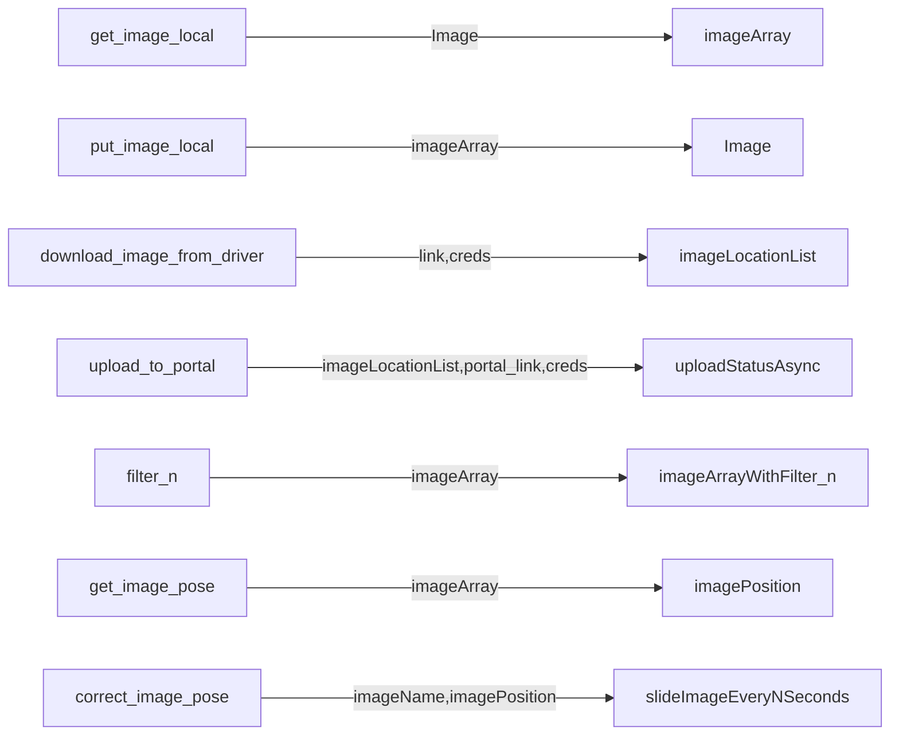

# Image Helper

# Structure

- ImageWand: main library
- FileHelpers: General Files operations
- PoseDetector: Detecting the Position of the vehicle reading the image
- Docs: For storing Useful Docs for the project
- Copy: Unused Code that can be useful in the future
- Test: Test for code
- console.py: You can call the package functions and test your codes here.

## TODO
- Create all the filters defined in FileHelpers\presets.json
- Create a load_filter which loads the json file and applies the filters in the presets at one go 
- Pose Detection for the Vehicle Poses
- Calculate the correction weights for adobe lightroom to the wand conversion
- Restructure the project to DDD for easier integration to other projects.
- A user manual for how to use the module

## Filters Added
- wand_whites
- wand_blacks
- wand_exposure_contrast
- wand_whites_fit
- wand_black_fit
- wand_exposure_contrast_fit

## Productivity
For  completing the project in time.

- Create and Assign Task
- Give certain time to complete the task

### Don't Worry and be happy!! 🚀🚀